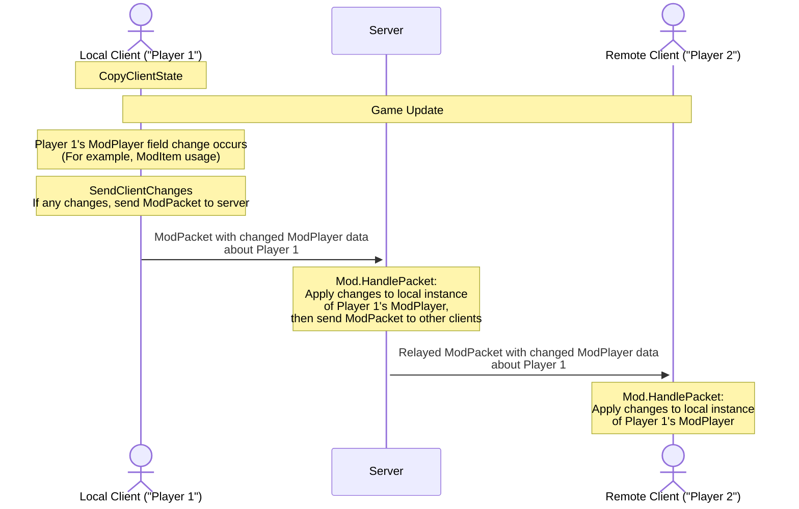

___
Looking to learn how to write and send your own ModPackets? Read our [intermediate netcode guide](intermediate-netcode).
___

# Introductory
Terraria is frequently played with many players on a server. Ensuring that your mods work well with friends is something that should not be an afterthought. Test early and often in multiplayer as you develop your mod. In this guide, we will go over how to make your mods multiplayer compatible, and hopefully show you it is not as difficult as it may seem.

# Main Concepts
The following are main concepts key to understanding how Terraria works in multiplayer.
1. When you play Terraria, your application is considered and called a "Client"
1. During multiplayer, your client and other players' clients connect to a "Server"
1. While connected to this server, the connected clients need to communicate well together through the server, so that things happening in the game are synchronized between these clients.

In essence: network packets are sent across clients to make sure the game is in sync for all players.
This happens all the time in multiplayer play, even in vanilla. **Clients CANNOT send or receive things DIRECTLY from other clients - the server has to act as a middleman.**

# Testing Netcode/Multiplayer compatibility
You can test multiplayer by hosting a server and having others join your server. The mod should automatically be synced from your computer to them even if you do not update version in build.txt. You do not need to publish to the workshop each time to test like this since the mod is coming directly from the server.

## Testing multiplayer locally

If you want to test alone, you can do this be launching 2 tModLoader clients on your computer. Usually Steam will only allow you to launch the game once, but nothing prevents manually launching the game a 2nd time. To launch an additional client, open up the tModLoader [install directory](https://github.com/tModLoader/tModLoader/wiki/Basic-tModLoader-Usage-Guide#install) and double click on the `start-tModLoader.bat` file (`.sh` for non-Windows users). This will launch the 2nd client. You'll want to be in windowed mode instead of fullscreen. From there, have the first client "host and play" and use "join via IP" on the 2nd client. Use `localhost` as the IP address on the 2nd client.

If you need to debug code running on the server, you'll want to [launch the debugger](https://github.com/tModLoader/tModLoader/wiki/Learn-How-To-Debug#launching-the-debugger) but select the "Terraria Server" launch target instead of "Terraria". If you do this, you'll need to manually launch 2 clients to connect to that server via "localhost".

Do note that with 2 clients, the game might not update as frequently when the program is not in focus, so you might need to ignore certain apparent issues.

# Automatic Syncing (non-ModPacket)
Terraria handles many network syncing things for us, we just have to use them right.

## NPC / ModNPC
With NPC, any non-deterministic decision must be synced to the clients. The Server is the owner of all NPC. As seen in [ExampleCustomAISlimeNPC.cs](https://github.com/tModLoader/tModLoader/blob/stable/ExampleMod/Content/NPCs/ExampleCustomAISlimeNPC.cs#L222), we use `npc.netUpdate` to trigger the NPC syncing code. Terraria will sync position, life, and other data from the server to the clients whenever `npc.netUpdate` has been set to true. We can use [ModNPC.SendExtraAI](https://docs.tmodloader.net/docs/stable/class_mod_n_p_c.html#ab97269b1204781b8cbf396c31e604154) and [ModNPC.ReceiveExtraAI](https://docs.tmodloader.net/docs/stable/class_mod_n_p_c.html#abb7c4468cbdba533146c4e35f3299a69) to sync extra data needed by all clients rather than `ModPacket`. This extra data will always be synced whenever the npc itself is synced.

Video Example of Desync Issue
<blockquote>

As mentioned in `ExampleCustomAISlimeNPC.cs`, non-deterministic decisions must be synced. This video shows the desync issue that happens if the random choice values in AI code are not synced properly. Notice how the slime on either client teleports to the correct position the server sends to the client when the NPC is synced at regular intervals:

https://github.com/user-attachments/assets/27b289c0-37a6-47e8-9e35-ea6f641612f0

Here is the correct behavior without the desync issue:

https://github.com/user-attachments/assets/f2bdcea4-8fe6-4eba-aa0d-0d36ade9a16d

</blockquote>

## Projectile / ModProjectile
Projectiles operate the same way as NPC, with the exception that the owner of a projectile is not always the Server. Projectiles spawned by players are owned by that player/client, while all other projectiles such as NPC spawned or World spawned projectiles are owned by the server. In the case of client changes, the `projectile.netUpdate` flag will sync the client's data to the server and the server will relay that to the other clients. An example is [Magic Missile](https://terraria.wiki.gg/wiki/Magic_Missile). The AI will check `if (Main.myPlayer == projectile.owner)` and then set `projectile.netUpdate = true;` if the position has changed due to the client players mouse position.

## World / ModSystem
World data should only ever be changed on the server. Whenever something important happens in the world, such as the Noon command on the server console, a Boss being defeated, or a random invasion triggering, World data is synced from the server to the clients. Whenever world data is synced, each `ModSystem` is also synced via [NetSend](https://docs.tmodloader.net/docs/stable/class_mod_system.html#af9ebfea8b152b555b030265946cace70) and [NetReceive](https://docs.tmodloader.net/docs/stable/class_mod_system.html#a144ef598fa0b3bcc2a0ac6bd1c5467aa). We can trigger a network sync of world data by calling `NetMessage.SendData(MessageID.WorldData);` on the server, as seen in [Abomination](https://github.com/tModLoader/tModLoader/blob/stable/ExampleMod/Old/NPCs/Abomination/CaptiveElement2.cs#L368) when we set `ExampleWorld.downedAbomination = true;`. Try to only do this when necessary.

## Item / ModItem / GlobalItem
Items are also synced. Use [`NetSend`](https://docs.tmodloader.net/docs/stable/class_mod_item.html#a80e9898e70b923e0a2a9b0d643504e8e) and [`NetRecieve`](https://docs.tmodloader.net/docs/stable/class_mod_item.html#a3d30fa657a2319543bdd619d2ad32f81) to sync data. Follow decompiled source code if you need to do anything unorthodox, most mods won't need to do anything such as triggering manual syncing. When Items are synced, only a very select subset of the fields are synced, this is why changing default values such as `Item.damage` in something like `UpdateInventory` is not recommended. Use [`ModifyWeaponDamage`](https://docs.tmodloader.net/docs/stable/class_mod_item.html#a1f23f4899b8fd233d4cbfc7698bb34ba) for that.

Items sync automatically in most relevant situations, such as when the item is dropped or transferred, but one situation that may require special consideration is when an item changes while in a players inventory that will have an effect on how the player behaves or how the item behaves when used. Without the syncing, the item could behave differently when observed by other clients. The `Item.NetStateChanged();` method can be called to trigger a resync of this inventory or equipment item. [UseStyleShowcase.cs](https://github.com/tModLoader/tModLoader/blob/stable/ExampleMod/Content/Items/UseStyleShowcase.cs) shows this in action. As the local code changes how the item behaves, the code ensures the changes are synced so that the behavior is consistent for all clients.

## ModTileEntity
Owned by the server. Sent to clients when a client first visits the "chunk"/"section" of the world where it resides. Changes are applied on the server and synced from the server to client. `ModTileEntity` code can manually trigger a sync by sending the `MessageID.TileEntitySharing` message, this will cause the current values to be sent to all clients to keep the data in sync. See [BasicTileEntity](https://github.com/tModLoader/tModLoader/blob/1.4.4/ExampleMod/Content/TileEntities/BasicTileEntity.cs#L66) for an example. Note how the `WaterFillLevel` setter triggers `MessageID.TileEntitySharing` to be sent, keeping clients in sync.

## Player / ModPlayer
Player data is very large, so special data syncing is used to minimize how often and which Player data must be synced. See `SyncPlayer`, `CopyClientState`, and `SendClientChanges` in the [ModPlayer Documentation](https://docs.tmodloader.net/docs/stable/class_mod_player.html) and [ExampleStatIncreasePlayer](https://github.com/tModLoader/tModLoader/blob/stable/ExampleMod/Common/Players/ExampleStatIncreasePlayer.cs) to learn their purpose and see them in use. Vanilla `Player` data such as inventory slots, health, position, and selected item are all synced automatically, so changing those in code will automatically sync to the server and be relayed to the other clients. Every client's accessories are updated on each client, so there is no need to sync the effects equipped accessories apply either. Biome flags will be synced automatically. Failure to use `SyncPlayer` and `SendClientChanges` will lead to desync and many other problems, they are very important to get right. 

### CopyClientState and SendClientChanges
`CopyClientState` and `SendClientChanges` are responsible for ensuring that the server and remote clients are kept in sync with a local client's changes. If there is `ModPlayer` data that must be present on the server and remote clients to run the game logic correctly, that data must be synced. The following diagram shows how they work together. 

First, `CopyClientState` is used to create a snapshot of the `ModPlayer` data. Next, the rest of the game update happens. During this time item usage, UI interactions, or many other things can happen, potentially changing `ModPlayer` data. Next, `SendClientChanges` is called and that snapshot is used to compare the current `ModPlayer` values against the snapshot `ModPlayer` values. If any changes are detected, the mod makes a `ModPacket` and sends the changed data to the server. The server receives that data, applies it to the local instance of that player's `ModPlayer`, and relays it to all other clients with a new `ModPacket`. All other clients receive that data and apply the contained data to the local instance of that player's `ModPlayer`.

# Hooks in Multiplayer
You'll want to be aware of where various "hooks" are executed. For example, some hooks only run on the server, like `ModSystem.PostUpdateWorld`. Some hooks only run on clients, like `ModProjectile.PreDraw`. Some hooks run on the server and clients, like `ModProjectile.AI`. Some hooks only run for the client that "owns" the entity, which we refer to as the "local client", such as `ModProjectile.CutTiles`. When a hook differentiates between the local client and other clients, the other clients are referred to as "remote clients".

The [documentation](https://github.com/tModLoader/tModLoader/wiki/Why-Use-an-IDE#documentation) has mentions of "where" each hook is called for many of the methods, but if it is not mentioned you can make an educated guess or test using the debugger or logging. It can be assumed that all hooks are called in single player as well unless they are specific to network syncing.

There are many things to keep in mind in regard to hooks in multiplayer, here are some common ones. Hooks that run everywhere usually need to produce the same results everywhere, meaning that data used in the logic potentially needs to be synced in some manner. Hooks that run on all clients sometimes should only run code on the local or owner client, for these checking `if (player.whoAmI == Main.myPlayer)` or some equivalent might be necessary to limit where code runs. Code that runs only on clients should not be used for gameplay effects, for example don't use drawing methods for gameplay purposes since they won't run on the server. If something runs on the server and clients, an `if (Main.netMode == NetmodeID.MultiplayerClient)` or `if (Main.netMode == NetmodeID.Server)` check can be used to limit execution to either clients or the server.

# Improving & beyond pre-defined hooks
Many examples can be found in ExampleMod for packets. For example you can use the Notepad++ "Find in files" feature and look for `GetPacket()` in the ExampleMod folder. Make sure 'Match case' and 'In all sub-folders' are checked. You'll find all locations in which a packet is created and likely sent.

If you feel you want to delve even deeper to learn how to send ModPackets and optimize your networking more, read our [intermediate netcode guide](intermediate-netcode).