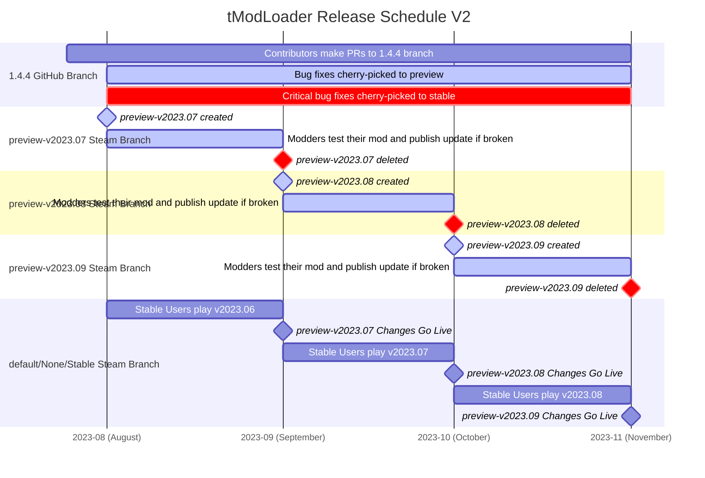

tModLoader currently has releases mirroring Terraria 1.3, 1.4.3, and 1.4.4+ content.     
The `1.3-legacy` version will not receive any major updates anymore    
The `1.4.3-legacy` version will not receive any major updates anymore    
The 1.4.4+ versions are divided amongst three different locations:    
1. Nightly 1.4.4+ GitHub actions for dev builds, 
2. Preview GitHub Releases and related Steam Beta (`preview-v2023.X`) for Pre-release builds of tModLoader, not intended for players, but useful for porting mods to upcoming releases
3. Stable GitHub releases and deployment to the default option in Steam. This is where vast majority of players, will play, and is designed around minimum interruption from tModLoader updates.

# 1.4.4+
1.4.4+ tModLoader is in active development. This means that the code changes frequently and that backwards compatibility with earlier releases is not guaranteed. Regular users should stick to the 'Stable' (default) version of tModLoader.

## Release Cycle V2 (Current)
At the start of each month, a new version of tModLoader arrives for Stable (default) players. 
This version is the is the culmination of one month's changes from development. 
The particular month is known by the YYYY.XX of the tModLoader Version Number

In order to get that to Stable and all the users, it goes through three stages:
1) Month 1: (Version 2023.6 made in June 2023) consists of building changes in on the Dev Branch in Github
2) Month 2: (Version 2023.6, current month is July 2023) consists of a Pre-Release / Staging build of tModLoader available for Modder Porting and release testing. This pre-release build will rarely see updates as it is a 'Release Candidate', so any changes are intended to be non-impacting to mods and players. It is available as GitHub Preview branch / Steam Beta (`preview-v2023.X`)
3) Month 3: Assuming everything is all good, we release the build that's on Preview to Stable, and thus make it available to all players as a stable experience.

As a reminder: Please do not hassle modders to make their mods available on the Preview (Pre-Release) versions of tModLoader. It is intended as an opportunity for them to get their mods ready for the next stable release on their own schedules, not tML or yours.

<!--- The code below can be used to generate the .png attached further below on https://mermaid.live/edit. Due to some formatting issues, it had to be manually edited. Use this code to reconstruct if needed.

-->

### Modder Instructions
Modders should keep an eye on `#⁠preview-update-log` in the [tModLoader Discord](http://discord.gg/tmodloader) and look for breaking changes related to functionality in your mods. If there is something listed with **Runtime Breakage** related to your mod, you should join the `preview-v2023.X` branch and publish an update before the start of the next month so that your users can continue using your mod seamlessly. If related changes are only listed as **Source-code Breakage**, there is no urgency and you will just need to follow the **Porting Notes** section after the changes are live. 

If you don't use Discord, the [Update Migration Guide](https://github.com/tModLoader/tModLoader/wiki/Update-Migration-Guide) will also be updated with the same information.

## Release Cycle V1 - Used during 1.4.3 era
At the start of each month, a new version of tModLoader arrives for Stable (default) players. 
This version is the is the culmination of one month's changes from development. 
The particular month is known by the YYYY.XX of the tModLoader Version Number

On the 21st of each month, we pause updating 1.4-Preview to give modders a chance to update their mods, ensuring that their mods will work when 1.4-Stable (default) updates on the 1st of the following month. The chart below should help visualize this process:
    

## Stable (default)
The 1.4-Stable (default) version of tModLoader is updated at the start of each month. This is the default version that Steam users will receive. If you are using mods that are well maintained, you should not experience any issues, but be aware that each month there is a chance that mods you enjoyed previously might have been abandoned by the author. In this situation, you will have to either wait for those mods to update or disable them.

## Preview
The Preview version of tModLoader is where recent changes to tModLoader are tested before reaching Stable (default). This version of tModLoader is where new features are tested, so things can break occasionally. Do not use this version of tModLoader for doing a normal playthrough. This version is intended for modders testing new features and players doing playtesting for those modders. 

**Release Cycle V2 Freeze:** At the end of a development month, we will bundle all the changes and deploy a new Preview version of tModLoader as a Release Candidate. It will be available in our staging environment via a Steam Beta 'Preview' option. It will be frozen from a breaking change perspective, and supported for bug fixes. It will, essentially, be available for a whole month as a Preview Freeze Period, just like V1.

**Release Cycle V1 Freeze:** Each time we add or change something in tModLoader, the 1.4-Preview version of tModLoader will update. On the 21st of each month, the 1.4-Preview version of tModLoader will stop changing, a time known as the preview freeze period. 

During the freeze period, modders should update their mods and publish them if updates are needed in anticipation for the start of the next month. At the start of the next month, 1.4-Preview becomes the new 1.4-Stable (default) and all users will update.

If curious what's upcoming, these [changes](https://github.com/tModLoader/tModLoader/compare/preview...1.4.4) will be brought into Preview.

# 1.4.3-Legacy
1.4.3 tModLoader is currently in maintenance mode as all of our efforts are focused on newer tModLoader. If Terraria updates, 1.4.3 tModLoader will be updated to account for new version checks and broken sprites to keep the game working, but no major efforts are being put into 1.4.3 tModLoader.

# 1.3-Legacy
1.3 tModLoader is currently in maintenance mode as all of our efforts are focused on newer tModLoader. If Terraria updates, 1.3 tModLoader will be updated to account for new version checks and broken sprites to keep the game working, but no major efforts are being put into 1.3 tModLoader.