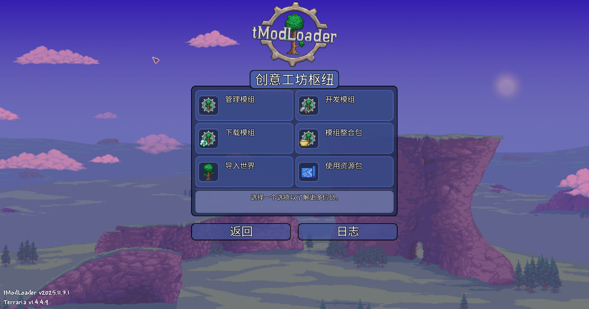

# 快速开始构建 Mod

你现在要做的事很简单：**先把 Mod 跑起来**。跑起来之后你再去学 API、再去整活，效率会高很多。

这篇只负责把你带到三个“验收点”：
- 验收点 1：你能在 IDE 里正常打开项目（智能提示可用）
- 验收点 2：你能编译成功（`Build succeeded`）
- 验收点 3：你能在 tModLoader 里 `Build + Reload`，并在游戏里拿到测试物品

如果你在中途遇到“玄学”，请把它当成梗：**先按“现象 -> 原因 -> 验证方式”排查**，别靠感觉。

---

# 1. 前置条件（一次性）

## 1.1 先启动过一次 tModLoader

操作：用 Steam 安装 `Terraria` 和 `tModLoader`，然后启动一次 `tModLoader` 再退出。  
目的：让它自动生成该有的目录结构。  
验收：你的文档目录里存在 `文档\My Games\Terraria\tModLoader\` 这类文件夹。

后面会用到的目录（Windows 默认）：
`文档\My Games\Terraria\tModLoader\ModSources\`

## 1.2 安装 `.NET 8 SDK`

操作：安装 **.NET 8 SDK**（注意是 SDK）。  
目的：tModLoader 1.4 编译需要它。  
验收：运行下面命令，输出里包含 `8.` 开头的版本号：

```bash
dotnet --list-sdks
```

{color:Mad}{只装 Runtime / 装成 .NET 6/7/9：不属于“差不多能用”，属于“确定不能用”。}

## 1.3 选择一个 IDE（推荐 VS 2022 或 VS Code）

你可以二选一：
- `Visual Studio 2022`：安装时勾选 `.NET desktop development` 工作负载
- `Visual Studio Code`：安装 `C# Dev Kit` 扩展

验收：你能打开一个 `.cs` 文件，并看到基本的语法高亮（这只是最低验收，后面还有智能提示验收）。

---

# 2. 生成 Mod 骨架（在 tModLoader 里）

操作（中文界面）：  
1. 启动 `tModLoader`  
2. 在主菜单点击 `Workshop（创意工坊）`  


3. 点击 `Develop Mods（开发模组）`  



4. 打开 `Mod Sources`  
5. 点击 `Create Mod（创建模组）`（或名字非常接近的按钮）并按提示生成


目的：让 tModLoader 给你生成一个可编译的项目骨架。  
验收：在 `文档\My Games\Terraria\tModLoader\ModSources\` 下出现一个你的 Mod 文件夹，里面至少有 `<ModName>.csproj`。

建议：Mod 名称只用英文/数字/下划线，例如 `MyFirstMod`。  
原因：少踩路径/打包/协作相关坑（这些坑经常被大家拿来当“玄学”讲）。


---

# 3. 正确打开项目（这一步决定你后面爽不爽）

## 3.1 Visual Studio 2022

操作：用资源管理器找到并打开 `.csproj`：  
`...\tModLoader\ModSources\<ModName>\<ModName>.csproj`

目的：让 VS 以“项目”的方式加载你的 Mod（而不是把你当成在编辑一堆散文件）。  
验收：在任意 `ModItem` 代码里输入 `Item.`，弹出补全列表。

{color:Mad}{只打开单个 `.cs` 文件：你会得到“能写字但没有一切 IDE 功能”的体验。请别给自己加难度。}

## 3.2 Visual Studio Code

操作：`文件 -> 打开文件夹`，选择整个 `<ModName>` 文件夹。  
目的：让 VS Code 正常加载项目上下文。  
验收：确保已安装 `C# Dev Kit`，并且输入 `Item.` 有补全列表。

---

# 4. 添加一个测试物品（最小可跑）

操作：在项目里新建文件 `Items/HelloSword.cs`（没有 `Items` 文件夹就自己创建）。  
目的：做一个“看得见摸得着”的最小成果，方便你验证流程。  
验收：文件保存后项目可编译（下一步会验证）。

把下面代码粘进去，然后把 `namespace MyFirstMod` 改成你项目实际使用的命名空间（通常就是你的 Mod 名）：  

```csharp
using Terraria;
using Terraria.ID;
using Terraria.ModLoader;

namespace MyFirstMod.Items
{
    public class HelloSword : ModItem
    {
        public override void SetDefaults()
        {
            Item.damage = 20;
            Item.DamageType = DamageClass.Melee;
            Item.width = 40;
            Item.height = 40;
            Item.useTime = 20;
            Item.useAnimation = 20;
            Item.useStyle = ItemUseStyleID.Swing;
            Item.knockBack = 5f;
            Item.value = Item.buyPrice(silver: 50);
            Item.rare = ItemRarityID.Blue;
            Item.UseSound = SoundID.Item1;
            Item.autoReuse = true;
        }

        public override void AddRecipes()
        {
            CreateRecipe()
                .AddIngredient(ItemID.Wood, 10)
                .AddTile(TileID.WorkBenches)
                .Register();
        }
    }
}
```

---

# 5. 编译（Build）并加载（Build + Reload）

## 5.1 编译（Build）

操作：  
- Visual Studio：`生成 -> 生成 <ModName>`  
- VS Code：在项目目录运行 `dotnet msbuild`

目的：确认你的代码在编译层面没问题。  
验收：看到 `Build succeeded`（或中文等价提示），并且没有 Error List 里的红色错误。

## 5.2 加载进 tModLoader（Build + Reload）

操作：回到 `tModLoader -> Workshop（创意工坊） -> Develop Mods（开发模组） -> Mod Sources`，找到你的 Mod，点击 `Build + Reload`。  
目的：把刚编译出来的内容打包成 `.tmod` 并加载进游戏。  
验收：在 `Mods（模组）` 菜单里能看到你的 Mod，并且可以启用。

## 5.3 游戏内验收（拿到 HelloSword）

操作：进入世界，站到工作台旁边，打开背包合成列表。  
验收：你能在合成列表里找到并合成 `HelloSword`（材料：`木头 x10` + `工作台`）。

---

# 6. 常见问题

- 现象：tModLoader 提示找不到 SDK / 无法编译  
  - 原因：没装 `.NET 8 SDK`，或装错版本  
  - 验证：`dotnet --list-sdks` 输出不包含 `8.`  
  - 处理：安装 `.NET 8 SDK` 后重启电脑（为了刷新 PATH），再复测上面的命令

- 现象：没有智能提示 / 补全  
  - 原因：VS 没打开 `.csproj`；或 VS Code 没装 `C# Dev Kit` / 没打开文件夹  
  - 验证：输入 `Item.` 没有补全列表  
  - 处理：按第 3 节重新打开项目，重新验收

- 现象：`Build + Reload` 提示 `.tmod` 被占用 / 写不进去  
  - 原因：Mod 还处于启用/占用状态  
  - 验证：错误信息里出现 “being used by another process” 或中文等价描述  
  - 处理：先在 `Mods（模组）` 菜单里禁用你的 Mod 再重载，或直接关闭 tModLoader 再编译

- 现象：改了 `SetDefaults()` 却看不出变化  
  - 原因：很多属性只在“物品生成时”应用，你手里那把旧的不会自动变  
  - 验证：把物品丢掉/重新合成后效果变化了  
  - 处理：重新生成物品再验证（或新开世界/重载）

---

# 7. 下一步看什么？

你已经把“能跑起来”的流程走通了。接下来建议去看更系统的内容：
- [tModLoader开发者指引](../螺线翻译tml教程/0-开始/2-tModLoader-guide-for-developers%20tModLoader开发者指引.md)
- [使用VisualStudio开发](../螺线翻译tml教程/0-开始/6-Developing-with-Visual-Studio%20使用VisualStudio开发.md)
- [使用VisualStudioCode开发](../螺线翻译tml教程/0-开始/7-Developing-with-Visual-Studio-Code%20使用VisualStudioCode开发.md)
