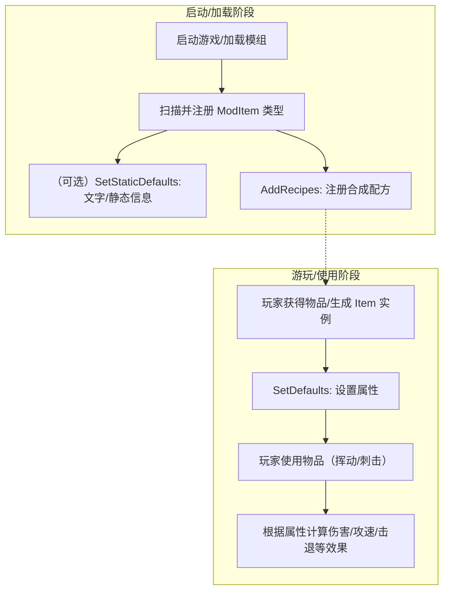

# 通过tModLoader生成的Mod——tModLoader初始武器

下面是tModLoader生成的默认的物品内容:

```csharp
using Terraria;
using Terraria.ID;
using Terraria.ModLoader;

namespace GreenHomeMod.Content.Items
{ 
	// This is a basic item template.
	// Please see tModLoader's ExampleMod for every other example:
	// https://github.com/tModLoader/tModLoader/tree/stable/ExampleMod
	public class FristSword : ModItem
	{
		// The Display Name and Tooltip of this item can be edited in the 'Localization/en-US_Mods.GreenHomeMod.hjson' file.
		public override void SetDefaults()
		{
			Item.damage = 50;
			Item.DamageType = DamageClass.Melee;
			Item.width = 40;
			Item.height = 40;
			Item.useTime = 20;
			Item.useAnimation = 20;
			Item.useStyle = ItemUseStyleID.Swing;
			Item.knockBack = 6;
			Item.value = Item.buyPrice(silver: 1);
			Item.rare = ItemRarityID.Blue;
			Item.UseSound = SoundID.Item1;
			Item.autoReuse = true;
		}

		public override void AddRecipes()
		{
			Recipe recipe = CreateRecipe();
			recipe.AddIngredient(ItemID.DirtBlock, 10);
			recipe.AddTile(TileID.WorkBenches);
			recipe.Register();
		}
	}
}
```

这份代码是 tModLoader 自动生成的 `ModItem` 模板：你只需要改 `SetDefaults()` 里的属性，和 `AddRecipes()` 里的配方，就能做出一个能在游戏里拿到、能挥动、能造成伤害的“第一把武器”。

## 这段代码在干什么？

先看结构：

- `public class FristSword : ModItem`：声明一个“模组物品”。类名就是你的物品类型（建议把 `FristSword` 改成 `FirstSword` 或更贴合的名字，避免拼写错误带来的混淆）。
- `SetDefaults()`：设置“这把武器的属性”，比如伤害、攻速、击退、稀有度等。
- `AddRecipes()`：注册“怎么合成这把武器”的配方。
- 注释里提到的 `Localization/...hjson`：显示名/提示（Tooltip）在本地化文件里改，不是在这份 `.cs` 里改。

## 代码执行顺序（从加载到能挥动）

下面用一个流程图把“什么时候会执行哪些方法”串起来（理解这个顺序，后面你就不容易改错位置）：



重点记两句话：

- `AddRecipes()`：一般在“加载阶段”跑，用来把配方塞进游戏（不是每次挥刀都跑）。
- `SetDefaults()`：在“物品实例需要属性时”跑（你拿到、生成、刷新该物品实例时），用来把 `Item.xxx` 填好。

## SetDefaults：常用属性快速对照

这几行最常改，也最容易搞混：

- `Item.damage`：基础伤害（数值越大越痛）。
- `Item.DamageType`：伤害类型（近战/远程/魔法/召唤等），决定受哪些加成影响。
- `Item.useTime` / `Item.useAnimation`：攻速相关。通常两者相近；`useTime` 更像“间隔”，`useAnimation` 更像“动作时长”。
- `Item.useStyle`：使用动作（挥动/刺击/举起等），比如 `Swing` 就是剑挥动。
- `Item.knockBack`：击退。
- `Item.value`：卖价/价值（影响商店与出售）。
- `Item.rare`：稀有度（颜色）。
- `Item.UseSound`：使用音效。
- `Item.autoReuse`：按住鼠标是否自动重复使用（不等于“攻速变快”）。

````quiz
type: choice
id: first-weapon-q1
question: |
  下面哪些属性**直接影响**“挥动频率/手感”（攻速相关）？
options:
  - id: A
    text: |
      `Item.useTime`
  - id: B
    text: |
      `Item.useAnimation`
  - id: C
    text: |
      `Item.knockBack`
  - id: D
    text: |
      `Item.value`
  - id: E
    text: |
      `Item.autoReuse`
answer:
  - A
  - B
explain: |
  `useTime/useAnimation` 是最直接的攻速相关参数；`autoReuse` 只是“是否自动连点”，不会让每次动作本身更快。
````

````quiz
type: tf
id: first-weapon-q2
question: |
  判断：`AddRecipes()` 一般只在“加载模组/注册配方”阶段执行一次，不会在你每次挥动武器时执行。
answer: true
explain: |
  物品挥动时走的是“使用逻辑”，配方注册属于“加载阶段”的内容。
````

## 实战：把模板改成“铜阔剑”风格

目标：保持 `Swing` 挥动手感，把伤害、击退、稀有度、价值、配方改得更像原版早期的铜剑，并把配方放到铁砧上。

你可以直接按下面这样改（数值不是唯一答案，但思路要对）：

```csharp
public override void SetDefaults()
{
    Item.damage = 7;
    Item.DamageType = DamageClass.Melee;
    Item.width = 40;
    Item.height = 40;

    Item.useTime = 20;
    Item.useAnimation = 20;
    Item.useStyle = ItemUseStyleID.Swing;

    Item.knockBack = 4.5f;
    Item.value = Item.buyPrice(copper: 90);
    Item.rare = ItemRarityID.White;
    Item.UseSound = SoundID.Item1;
    Item.autoReuse = true;
}

public override void AddRecipes()
{
    Recipe recipe = CreateRecipe();
    recipe.AddIngredient(ItemID.CopperBar, 7);
    recipe.AddTile(TileID.Anvils);
    recipe.Register();
}
```

````quiz
type: choice
id: first-weapon-q3
question: |
  下面哪些改动是“把配方变成：`CopperBar x7` + `Anvils`”所必需的？
options:
  - id: A
    text: |
      把 `AddIngredient` 改成 `ItemID.CopperBar`
  - id: B
    text: |
      把数量改成 `7`
  - id: C
    text: |
      把 `AddTile` 改成 `TileID.Anvils`
  - id: D
    text: |
      删除 `recipe.Register()`
answer:
  - A
  - B
  - C
explain: |
  `Register()` 用来把配方注册进游戏，删掉就等于“配方写了但没生效”。
````

## 小结：你现在应该会什么？

- 能看懂 `ModItem` 模板里的两个核心方法：`SetDefaults()` 与 `AddRecipes()`。
- 能把模板参数改成“早期铜剑”风格（伤害/攻速/击退/稀有度/价值）。
- 能把合成配方改成 “铜锭 + 铁砧” 并在游戏里验证它出现。
