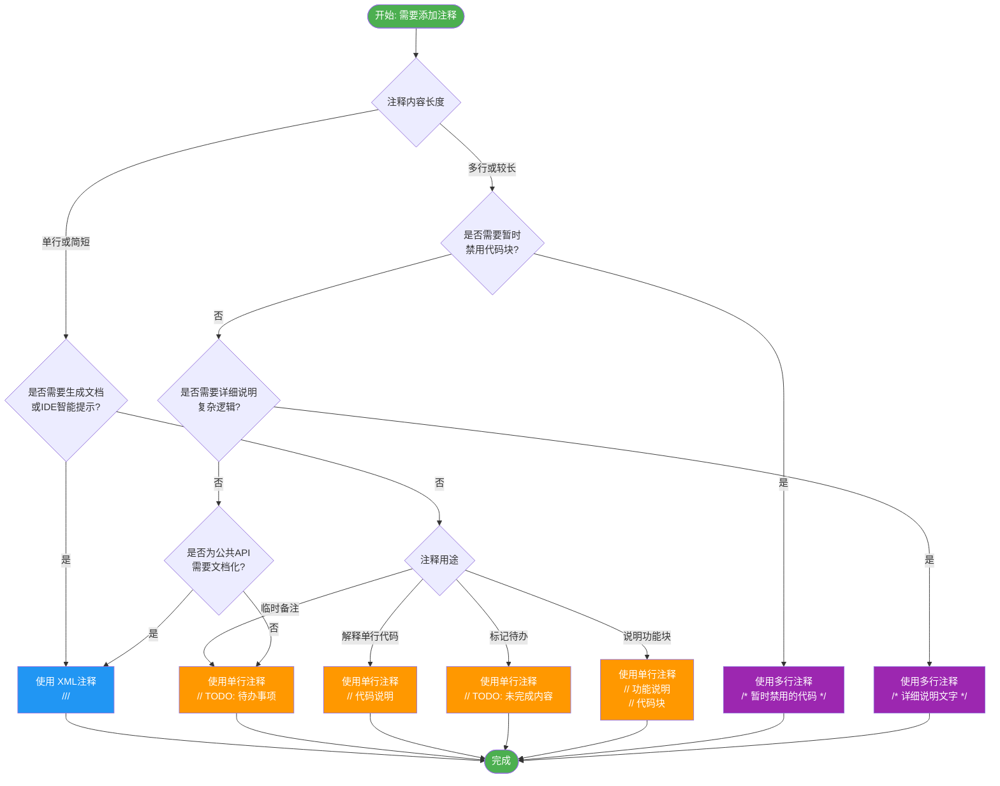

这篇文章是为了让新人能够了解C#的基本语法。

# 作用域

C# 的作用域一般用 `{ }` 包裹，这是 C 系语言的常见约定。

与 Python 的缩进决定作用域不同，C 系语言通常通过 `{ }` 决定作用域，下面是两段代码的演示：

```python
# 同一作用域内的变量访问
a = 0
b = 1
print(a + b)  # 正常工作，输出 1

# 下面会报错
if False:
    x = 5

print(x)  # NameError: name 'x' is not defined
```

C# 示例如下：
```csharp
// 不会报错的代码
{
    int x = 0;
    int y = 0;
    // 使用 tModLoader 的 API 作为示例输出
    Main.NewText(x + y);
}

// 报错的代码
{
    int x = 0;
    {
        int y = 0;
    }
    Main.NewText(x + y); // y 不在当前作用域
}
```

# 注释

注释常见有三类，下面分别介绍。

## 单行注释

```csharp
// 单行注释写法
```

### 单行注释的规范

下面给出几种常见写法，重点是让意图清晰，便于维护。

#### TODO注释

```csharp
// TODO: 这是没完成的东西/这是我准备做的东西
```

通过`TODO`注释，可以通过查找快速找到自己准备做的内容，有一些IDE，例如***Rider***它就会自动标记`TODO`

#### 说明一行操作注释

```csharp
Main.newText("发消息"); // 调用newText发送消息
```

适用于解释单行代码的目的，避免读者反复推断。

#### 说明下面功能注释

```csharp
// 功能1...

// 功能2:通过if区分一个bool条件，用以执行一些特殊AI
if(flag)
    AI_Test();
else
    AI_Test2();

// 功能3...
```

建议写法：

1. 使用回车分离每块代码处理的内容
2. 在这一块内容的顶部添加注释，说明被回车隔离开的这一段内容执行了什么操作

优点：分段清晰，便于快速定位和修改。

当代码块较长时，按功能分段并在段首写注释，有助于维护。

## 多行注释

```csharp
/*
这是多行注释的写法
可以写很多行的内容
不会被编译器编译
*/
```
多行注释使用 /\* \*/ 包裹，在其中可以写入任意长度的注释内容。这种注释方式适用于：

- 需要写大段说明文字的情况
- 暂时禁用某段代码（代码块注释）
- 对复杂逻辑进行详细说明

## XML注释

XML注释是C#特有的功能，使用 /// 开始，允许在注释中使用XML标签来创建结构化的文档，语法和XML一致，都需要有`<内容>包裹内容</内容>`这样的写法

```csharp
/// <summary>
/// 计算两个整数的和
/// </summary>
/// <param name="a">第一个整数</param>
/// <param name="b">第二个整数</param>
/// <returns>返回两个整数的和</returns>
/// <example>
/// 示例用法:
/// <code>
/// int result = Add(2, 3); // 结果为5
/// </code>
/// </example>
public int Add(int a, int b)
{
    return a + b;
}
```

XML注释的主要标签包括：
- `<summary>` - 描述成员的总体功能
- `<param>` - 描述方法参数
- `<returns>` - 描述返回值
- `<remarks>` - 提供附加信息
- `<example>` - 提供使用示例
- `<exception>` - 描述可能抛出的异常

XML注释的优势是可以被工具（如Visual Studio IntelliSense、Sandcastle等）自动生成文档，并在代码提示时显示这些文档信息

## 注释使用场景

|      注释类型      |                   适用场景                   |              优势              |         注意事项         |
| :----------------: | :------------------------------------------: | :----------------------------: | :----------------------: |
|  单行注释 (`//`)   |  临时备注、解释单行代码、标记待办事项(TODO)  |    简洁方便、不影响代码布局    | 避免过长内容，应简洁明了 |
| 多行注释 (`/* */`) |      暂时屏蔽代码块、编写较长的解释说明      | 可以注释多行内容、适合大段说明 |       不能嵌套使用       |
|  XML注释 (`///`)   | 为公共API编写文档、生成外部文档、IDE智能提示 |  可生成专业文档、增强IDE支持   |    需遵循XML语法规范     |

## 注释选择流程图



这个流程图帮助你根据不同的使用场景选择合适的注释类型：

- **单行注释 (`//`)**：适用于临时备注、解释单行代码、标记待办事项
- **多行注释 (`/* */`)**：适用于暂时禁用代码块、编写较长的解释说明
- **XML注释 (`///`)**：适用于为公共API编写文档、生成外部文档、IDE智能提示

